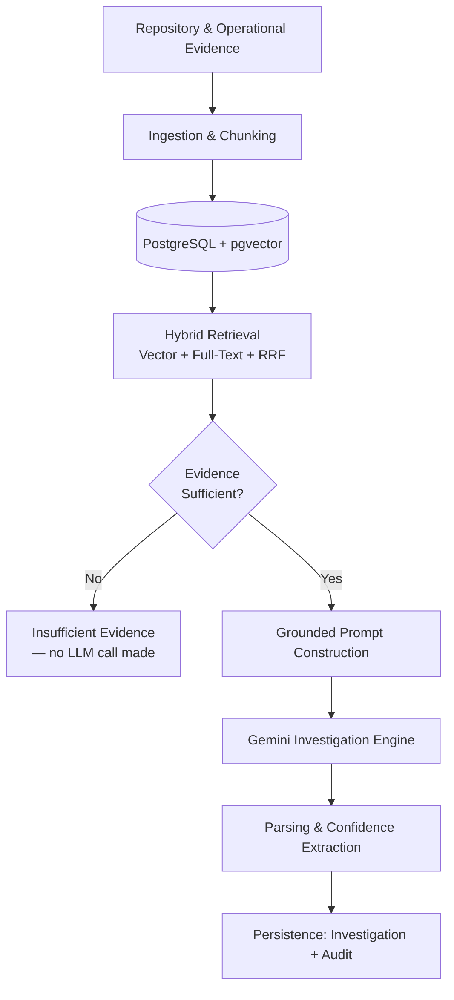

<div align="center">

# IncidentWeave

**Repository-aware AI incident investigation platform for backend systems.**

[](https://github.com/iamswayam/incidentweave/actions/workflows/ci.yml)


IncidentWeave investigates production incidents by combining repository context, operational evidence, hybrid retrieval, and evidence-grounded AI investigation — built incrementally, with every phase verified against a real database and a real Gemini API before moving on.

[Architecture](#architecture) • [Tech Stack](#technology-stack) • [Getting Started](#local-development) • [Engineering Log](#engineering-documentation) • [Roadmap](#roadmap)

</div>

---

## Table of Contents

- [Project Status](#project-status)
- [Why This Project](#why-this-project)
- [Architecture](#architecture)
- [Technology Stack](#technology-stack)
- [Database](#database)
- [Project Structure](#project-structure)
- [Local Development](#local-development)
- [Testing](#testing)
- [Continuous Integration](#continuous-integration)
- [Engineering Principles](#engineering-principles)
- [V1 Scope Discipline](#v1-scope-discipline)
- [Engineering Documentation](#engineering-documentation)
- [Roadmap](#roadmap)
- [Current Verification](#current-verification)

---

## Project Status

| Phase | Description | Status |
|---|---|---|
| 1 | Project Setup | ✅ Complete |
| 2 | Database & Persistence | ✅ Complete |
| 3 | Repository Ingestion & Chunking | ✅ Complete |
| 4 | Embeddings & Retrieval | ✅ Complete |
| 5 | Investigation Engine | ✅ Complete |
| 6 | Grounding & Confidence | 🔜 Next |
| 7 | Controlled Tools & Audit | Planned |
| 8 | Evaluation | Planned |
| 9 | Production CLI / API | Planned |

**Current milestone: Phase 5 complete.**

<details>
<summary><strong>Phase 1 — Project Setup</strong></summary>
<br>

- FastAPI application with a health endpoint
- Docker Compose environment (PostgreSQL + pgvector)
- Environment configuration via Pydantic Settings
- pytest and Ruff tooling
- GitHub Actions CI

</details>

<details>
<summary><strong>Phase 2 — Database & Persistence</strong></summary>
<br>

- SQLAlchemy 2.x async integration
- Alembic migrations, version-controlled from the first commit
- Centralized ORM models: `Repository`, `Chunk`, `Investigation`, `Audit`
- `VECTOR(768)` embedding storage via pgvector
- Real PostgreSQL integration tests — no mocked database layer

</details>

<details>
<summary><strong>Phase 3 — Repository Ingestion & Chunking</strong></summary>
<br>

- Local repository ingestion script with fixed-size, overlapping line-window chunking
- Idempotent re-ingestion (safe to re-run against the same repository)
- Tool/cache/VCS directory exclusion, tuned after catching real corpus pollution during development

</details>

<details>
<summary><strong>Phase 4 — Embeddings & Retrieval</strong></summary>
<br>

- Gemini embeddings (`gemini-embedding-001`), explicit 768-dimensional output
- Vector similarity search via pgvector cosine distance
- PostgreSQL full-text search over chunk content
- Hybrid retrieval via Reciprocal Rank Fusion (RRF), verified against hand-computed arithmetic on real queries

</details>

<details>
<summary><strong>Phase 5 — Investigation Engine</strong></summary>
<br>

- Evidence-grounded prompt construction from hybrid retrieval results
- Gemini text generation (`gemini-3.5-flash-lite`) with timeout, bounded retry/backoff, and fail-loud error handling
- Response parsing: categorical confidence extraction, citation matching against retrieved evidence
- **Evidence-sufficiency guard**: a query is only sent to Gemini if retrieval clears both an RRF threshold *and* a raw vector-distance threshold — a single-signal check was found to produce false positives on unrelated queries during testing, and was hardened accordingly
- Full persistence: one `Investigation` row plus one `Audit` row per query, carrying retrieval scores and evidence IDs
- End-to-end CLI (`scripts/investigate.py`), verified against a real repository with a diagnosis independently cross-checked line-by-line against the actual retrieved source code

</details>

---

## Why This Project

Most RAG demos stop at "retrieval works." IncidentWeave is built around a stricter standard: **evidence before generation, always**.

- The system will not call the LLM at all if retrieval evidence is weak — this guard was tightened after a real false positive was caught during manual testing, not assumed to be correct from design alone.
- Every investigation is fully auditable: retrieval scores, cited evidence, and the raw model response are persisted together.
- Every phase in this README was verified against a live PostgreSQL database and a live Gemini API call before being marked complete — not just unit-tested in isolation. The full debugging history, including real bugs found and fixed, is kept in [`docs/`](#engineering-documentation) rather than smoothed over.

---

## Architecture



Each subsystem is introduced only when the roadmap requires it — see [V1 Scope Discipline](#v1-scope-discipline).

---

## Technology Stack

| Category | Technologies |
|---|---|
| **Backend** | Python 3.12+, FastAPI, Pydantic Settings, Uvicorn |
| **Persistence** | PostgreSQL, pgvector, SQLAlchemy 2.x (async), Psycopg 3, Alembic |
| **AI & Retrieval** | Gemini Embeddings, Gemini Generation, pgvector cosine search, PostgreSQL Full-Text Search, Reciprocal Rank Fusion |
| **Development & Quality** | Docker, Docker Compose, pytest, Ruff, GitHub Actions |
| **Planned** | Grounding refinements, controlled investigation tools, evaluation harness |

---

## Database

Four core models back the persistence layer:

| Model | Purpose |
|---|---|
| `Repository` | One row per ingested codebase |
| `Chunk` | Code/log/runbook evidence, `VECTOR(768)` embedding column |
| `Investigation` | One row per query: response, model, latency, token usage, confidence |
| `Audit` | One row per investigation: retrieval scores, cited evidence, full tool-call trace |

The `vector` extension and full schema are managed through version-controlled Alembic migrations — no manual database changes.

---

## Project Structure

```text
incidentweave/
├── app/
│   ├── db/
│   │   ├── models/
│   │   │   ├── audit.py
│   │   │   ├── chunk.py
│   │   │   ├── investigation.py
│   │   │   └── repository.py
│   │   ├── base.py
│   │   └── session.py
│   ├── retrieval/
│   │   ├── vector_search.py
│   │   ├── fulltext_search.py
│   │   └── hybrid_search.py
│   ├── investigation/
│   │   ├── prompt.py
│   │   ├── generation.py
│   │   ├── parsing.py
│   │   ├── guard.py
│   │   └── persistence.py
│   └── main.py
│
├── scripts/
│   ├── ingest_repo.py
│   ├── embed_chunks.py
│   ├── search_repo.py
│   └── investigate.py
│
├── migrations/
│   └── versions/
│
├── tests/
│   ├── integration/
│   └── unit/
│
├── docs/
│   ├── phase1-project-setup.md ... phase5-investigation-engine.md
│   └── learning/
│
├── .github/workflows/
├── alembic.ini
├── docker-compose.yml
├── pyproject.toml
└── README.md
```

Repository ingestion is implemented as standalone scripts in `scripts/`, not as an `app/ingestion/` module — a deliberate deviation from the original planned structure.

---

## Local Development

```bash
# 1. Create and activate a virtual environment
python -m venv .venv
.venv\Scripts\Activate.ps1   # Windows

# 2. Install the project
pip install -e ".[dev]"

# 3. Configure environment variables
Copy-Item .env.example .env   # then fill in real values — never commit .env

# 4. Start Postgres + pgvector
docker compose up -d db

# 5. Apply migrations
alembic upgrade head

# 6. Run the API
uvicorn app.main:app --reload
```

Health check: `GET /health`

---

## Testing

```bash
pytest                    # full suite
pytest tests/unit         # unit tests only
pytest tests/integration  # requires a running PostgreSQL + pgvector instance
ruff check .              # static analysis
```

Integration tests validate real PostgreSQL connectivity, the `vector` extension, `VECTOR(768)` support, and ORM relationships — nothing is mocked at the database layer.

---

## Continuous Integration

GitHub Actions runs on every push and pull request:

1. Python 3.12 setup
2. Dependency install (`pip install -e ".[dev]"`)
3. Ruff checks
4. PostgreSQL + pgvector service startup and health verification
5. `alembic upgrade head`
6. Full test suite
7. Docker image build

All checks run against a real Postgres+pgvector service container — not a mock.

---

## Engineering Principles

- Incremental, phase-based implementation
- Evidence-first investigation — retrieval before generation, always
- Explicit grounding and confidence, never a silent guess
- Automated verification before any phase is marked complete
- Thin API/CLI boundaries; business logic stays out of transport layers
- No premature infrastructure or abstraction

---

## V1 Scope Discipline

V1 deliberately excludes: LangGraph, Redis/Celery, MCP, S3, Vision AI, Kubernetes, Elasticsearch, Pinecone, Weaviate, and authentication — introduced only when a later phase actually requires them, not in anticipation of needing them.

---

## Engineering Documentation

Every phase has two levels of documentation, kept deliberately separate:

- **[`docs/phaseN-*.md`](docs/)** — the full build log: task specs, real bugs found, real fixes, real command output. This is the working history, warts included.
- **[`docs/learning/`](docs/learning/)** — condensed, interview-ready writeups: what was built, why, and the key concept explained plainly.

Nothing in either is retrofitted after the fact — every entry was written from real, verified output at the time the work happened.

---

## Roadmap

```mermaid
flowchart LR
    P1[01 Setup] --> P2[02 Database] --> P3[03 Ingestion] --> P4[04 Retrieval] --> P5[05 Investigation] --> P6[06 Grounding] --> P7[07 Tools & Audit] --> P8[08 Evaluation] --> P9[09 Production API]

    style P1 fill:#2ea44f,color:#fff
    style P2 fill:#2ea44f,color:#fff
    style P3 fill:#2ea44f,color:#fff
    style P4 fill:#2ea44f,color:#fff
    style P5 fill:#2ea44f,color:#fff
```



**Completed:** Phases 1 through 5
**Next:** Phase 6 — Grounding & Confidence

---

## Current Verification

```text
Ruff                      PASS
PostgreSQL                PASS
pgvector                  PASS
Alembic migration         PASS
VECTOR(768)               PASS
SQLAlchemy persistence    PASS
Test suite                16 passed
Real ingestion run        PASS (23 files, 31 chunks; tool/cache dirs excluded)
Real Gemini embedding     PASS (31 chunks embedded; 768-dim vectors confirmed)
Real hybrid search        PASS (RRF arithmetic independently verified)
Real investigation run    PASS (diagnosis cross-checked line-by-line against
                           retrieved source; evidence guard verified against
                           both a real answerable and a real nonsense query)
GitHub Actions            PASS
```

One non-blocking FastAPI/Starlette `httpx` deprecation warning is present in the test output.

---

<div align="center">

*A personal backend/AI engineering portfolio project.*
**[@iamswayam](https://github.com/iamswayam)**

</div>
